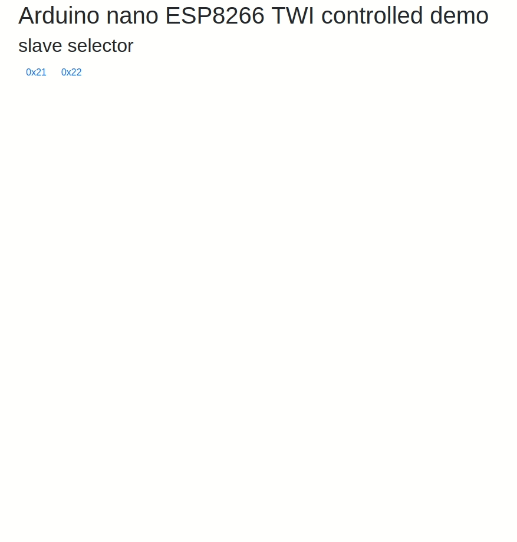
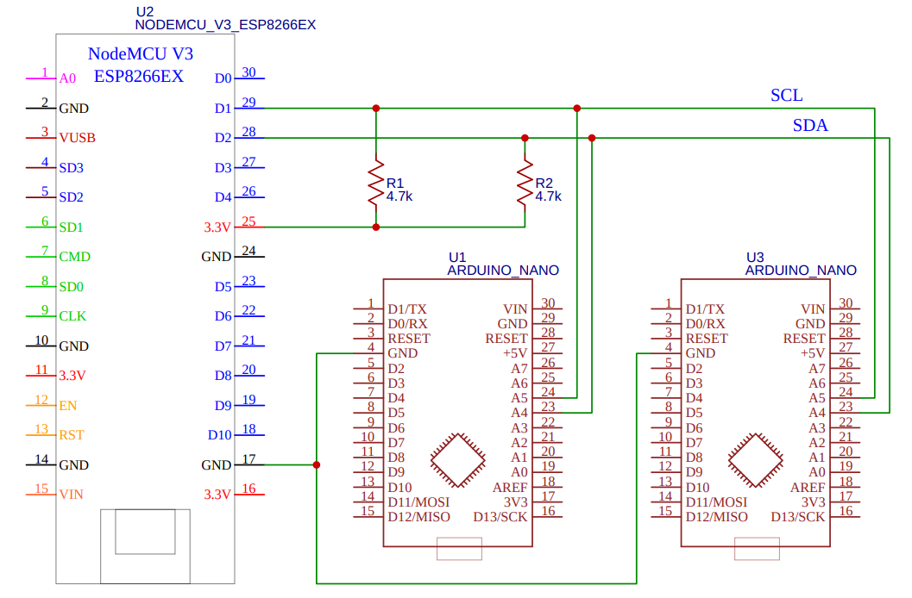

# iot-arduino-ioexpander-esp8266-controller-twi

- [browser page](#browser-page)
- [requirements](#requirements)
- [features](#features)
- [setup](#setup)
- [advertisement](#advertisement)
- [api ( esp8266 controller )](#api--esp8266-controller-)
- [api ( arduino nano slave )](#api--arduino-nano-slave-)
  
arduino nano as ioexpander controlled by esp8266 through TWI

## browser page

## requirements

- esp8266 nodemcu
- arduino nano V3

## setup

- [schematics](https://easyeda.com/editor#id=|676ad221579b4190a2b0e6b3f3755e87)

## advertisement

Take care not to set as output ports connected to ground ( [reference](https://www.rugged-circuits.com/10-ways-to-destroy-an-arduino/) )

## features

- imagemap of arduino nano ports
- index.htm, app.js, image.png served by esp8266 ( encoded into flash by [gen-h](esp8266-controller-twi/gen-h) )
- scalable TWI slave devices

## HTTP api ( esp8266 controller )

- `busaddr` : slave twi bus address
- `portstr` : one of `"D2", "D3", "D4", "D5", "D6", "D7", "D8", "D9", "D10", "D11", "D12", "D13", "A0", "A1", "A2", "A3"`
- `mode` : 0 (input) - 1 (output) - 2 (input pullup)

| **api** | **description** | **result example** |
|---|---|---|
| `/api/scan` | list of twi slave devices addresses (dec) | `[8,19]` |
| `/api/getportmodes/busaddr` | retrieve port mode 0=input, 1=output, 2=input_pullup of slave at `addr` ports | `[{ "port": "D2", "mode": 0 },...,{ "port": "A3", "mode": 0 }]` |
| `/api/getportvalues/busaddr` | retrieve port value ( digitalRead ) | `[{ "port": "D2", "value": 0 },...,{ "port": "A3", "value": 0 }]` |
| `/api/setportmode/bus/portstr/mode` | change port mode ( pinMode ) | |
| `/api/setportvalue/bus/portstr/value` | change port value ( digitalWrite ) | |

## TWI api ( arduino nano slave )

- note : subsequently to `get` twi calls master should request result

| **api** | **description** | **request example** |
|---|---|---|
| `getportmode portstr` | retrieve port mode (0,1,2) | `0` |
| `setportmode portstr mode` | set port mode (0,1,2) | |
| `getportvalue portstr` | retrieve port value | `1` |
| `setportvalue portstr value` | set port value | |
