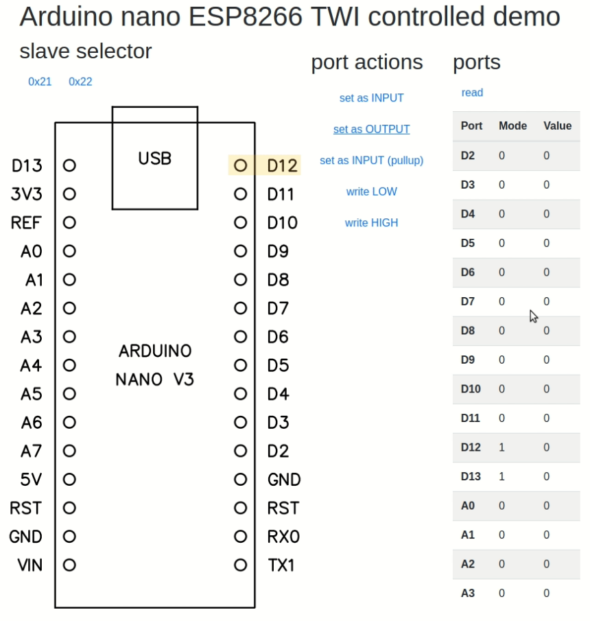

# iot-arduino-ioexpander-esp8266-controller-twi

arduino nano as ioexpander controlled by esp8266 through TWI

## requirements

- esp8266 nodemcu
- arduino nano V3

## features

- imagemap of arduino nano ports
